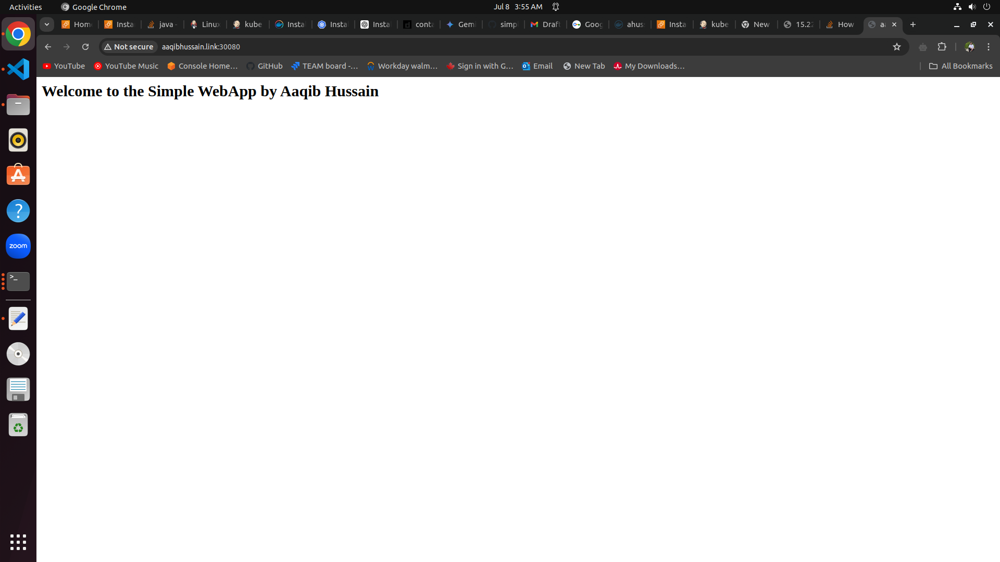

# Build and deploy containerized web app via jenkins pipeline to kubeadm
Today, we are building a web Java app container using Docker and deploying it to a Kubernetes cluster. We are using Jenkins pipeline to automate the entire process.

### Prerequisites
1. AWS account with some credits.
2. Already created an SSH key on the AWS account and downloaded the private part of it.
3. Domain name and hosted zones created.

## Provisioning infrastructure using Terraform
Before running the main Terraform to provision, run the main folder from 'LockNremote' to get a remote bucket and DynamoDB to store data remotely and lock the Terraform state while the infrastructure is being configured.

1. Download the Terraform configuration from GitHub.
2. Edit the variables, such as key name, domain name, etc.
3. Run 'terraform init'.
4. Run 'terraform validate'.
5. Run 'terraform plan'.
6. Run 'terraform apply'.
7. You should have four EC2 instances, two in the public subnet and two in the private subnet.

## Setting up Jenkins on your system
To set up Jenkins on your system, please follow these steps:

1. Download and install Java 11 by running the following commands:
```
sudo apt update
sudo apt install openjdk-11-jdk
```

2. Next, download Jenkins from the official website. Follow the instructions provided on the website. The current commands are added below. Run the following commands to add the Jenkins repository key and update your package list:
```
sudo wget -O /usr/share/keyrings/jenkins-keyring.asc \
    https://pkg.jenkins.io/debian-stable/jenkins.io-2023.key
echo "deb [signed-by=/usr/share/keyrings/jenkins-keyring.asc]" \
    https://pkg.jenkins.io/debian-stable binary/ | sudo tee \
    /etc/apt/sources.list.d/jenkins.list > /dev/null
sudo apt-get update
```

4. Install Jenkins by running the following command:
```
sudo apt-get install jenkins
```

5. After the installation is complete, retrieve the initial admin password by executing the following command:
```
sudo cat /var/lib/jenkins/secrets/initialAdminPassword
```


6. Install the suggested plugins to enhance the functionality of Jenkins.

7. Finally, create an admin user to manage Jenkins.


## Docker Setup on EC2 and configuring on Jenkins
To set up Docker on the EC2 instance and configure it in Jenkins, follow these steps:

1. SSH into the Jenkins EC2 server and use it as a jump server.

2. Copy the SSH key and create an SSH key in Jenkins. Make sure to change the permissions for the key file using the following command, then SSH to the Docker's EC2:
    ```
    chmod 400 key-name
    ```

3. Install Java 11 by running the following commands:
    ```
    sudo apt update
    sudo apt install openjdk-11-jdk
    ```

4. Open the official Docker website and follow the instructions for downloading Docker on Ubuntu. The instructions can be found at: [https://docs.docker.com/engine/install/ubuntu/](https://docs.docker.com/engine/install/ubuntu/)

5. Remove any conflicting packages by running the following command:
    ```
    for pkg in docker.io docker-doc docker-compose docker-compose-v2 podman-docker containerd runc; do sudo apt-get remove $pkg; done
    ```

6. Install Docker using apt by adding Docker's official GPG key and repository. Run the following commands:
    ```
    sudo apt-get update
    sudo apt-get install ca-certificates curl
    sudo install -m 0755 -d /etc/apt/keyrings
    sudo curl -fsSL https://download.docker.com/linux/ubuntu/gpg -o /etc/apt/keyrings/docker.asc
    sudo chmod a+r /etc/apt/keyrings/docker.asc
    echo "deb [arch=$(dpkg --print-architecture) signed-by=/etc/apt/keyrings/docker.asc] https://download.docker.com/linux/ubuntu $(. /etc/os-release && echo "$VERSION_CODENAME") stable" | sudo tee /etc/apt/sources.list.d/docker.list > /dev/null
    sudo apt-get update
    sudo apt-get install docker-ce docker-ce-cli containerd.io docker-buildx-plugin docker-compose-plugin
    ```

7. Verify that the Docker Engine installation is successful by running the hello-world image:
    ```
    sudo docker run hello-world
    ```

8. Add the Ubuntu user to the Docker group:
    ```
    sudo usermod -aG docker ubuntu
    ```

9. Add the EC2 instance as a slave to Jenkins. Follow these steps:
    - Go to the Jenkins portal.
    - Navigate to "Manage Jenkins" -> "Credentials" -> "Global (domain)" -> "Add credentials".
    - Select "SSH Username with private key" as the kind.
    - Set the ID as "ssh-key".
    - Set the username as "ubuntu".
    - Select "Enter directly" and paste the SSH key.
    
    - Save the credentials.

10. Again, go to "Manage Jenkins" -> "Nodes" -> "New Node".
     - Set the name as "docker".
     - Select "Permanent Agent".
     - Set the remote root directory as "/home/ubuntu".
     - Set the label as "docker".
     - Choose "Launch agent via SSH" as the launch method.
     - Set the host as "jen.URL".
     - Select the "ubuntu" credentials.
     - Set the host key verification strategy as "Non verification strategy".
     - Save the configuration.

11. In the "Nodes" section, select the "docker" node and check the logs to ensure that the agent successfully connects and goes online.

## Kubernetes Setup on EC2 and configuring on Jenkins
To set up Kubernetes, follow these steps:

1. SSH into the Jenkins EC2 server using the same key file to SSH into the Kubernetes EC2 from Jenkins.

2. Install Java 11 by running the following commands:
    ```
    sudo apt update
    sudo apt install openjdk-11-jdk
    ```

3. Update the package list and install Docker by running the following commands:
    ```
    apt-get update
    apt-get install apt-transport-https
    apt install docker.io -y
    docker –version
    systemctl start docker
    systemctl enable docker
    ```

4. Download and install `kubeadm`, `kubelet`, `kubectl`, and `kubernetes-cni`. If the commands are not working, use the official website for installation instructions:
    ```
    sudo apt-get update
    sudo apt-get install -y apt-transport-https ca-certificates curl gpg

    curl -fsSL https://pkgs.k8s.io/core:/stable:/v1.30/deb/Release.key | sudo gpg --dearmor -o /etc/apt/keyrings/kubernetes-apt-keyring.gpg

    echo 'deb [signed-by=/etc/apt/keyrings/kubernetes-apt-keyring.gpg] https://pkgs.k8s.io/core:/stable:/v1.30/deb/ /' | sudo tee /etc/apt/sources.list.d/kubernetes.list

    sudo apt-get update
    sudo apt-get install -y kubelet kubeadm kubectl kubernetes-cni
    sudo apt-mark hold kubelet kubeadm kubectl kubernetes-cni
    sudo systemctl enable --now kubelet
    ```

5. Disable swap by running the following command:
    ```
    sudo swapoff -a
    ```

6. Start port forwarding by editing the `/etc/sysctl.conf` file:
    - Uncomment or add the line `net.ipv4.ip_forward=1` (remove any preceding #).
    - Save the file.
    - Run `sudo sysctl -p` to apply the changes.
    

7. Start the control plane node by running the following command:
    ```
    sudo kubeadm init
    ```
    Note: Keep note of the join command.

8. Set up the local kubeconfig by running the following commands:
    ```
    mkdir -p $HOME/.kube
    sudo cp -i /etc/kubernetes/admin.conf $HOME/.kube/config
    sudo chown $(id -u):$(id -g) $HOME/.kube/config
    ```

9. Install a pod network add-on by running the following commands:
    ```
    kubectl apply -f https://raw.githubusercontent.com/flannel-io/flannel/v0.22.2/Documentation/k8s-old-manifests/kube-flannel-rbac.yml
    kubectl apply -f https://raw.githubusercontent.com/coreos/flannel/master/Documentation/kube-flannel.yml
    ```

10. Reboot the system by running the following command:
     ```
     sudo reboot
     ```

11. Add Kubernetes as a slave to Jenkins by following these steps:
     - Go to the Jenkins portal.
     - Navigate to "Manage Jenkins" -> "Nodes" -> "New Node".
     - Set the name as "k8s".
     - Select "Permanent Agent".
     - Set the remote root directory as "/home/ubuntu".
     - Set the label as "k8s".
     - Choose "Launch agent via SSH" as the launch method.
     - Set the host as "kube.URL".
     - Select the "ubuntu" credentials.
     - Set the host key verification strategy as "Non verification strategy".
     - Save the configuration.

12. Verify that the agent successfully connects and goes online by checking the logs in the "Nodes" section.

13. Add the `kube/config` file as a credential in Jenkins:
     - Run `cat ~/.kube/config` to view the contents of the file.
     - Copy the contents and save it on your local machine.
     - Go to the Jenkins portal.
     - Navigate to "Manage Jenkins" -> "Credentials" -> "Global (domain)" -> "Add credentials".
     
     - Select "Secret file" as the kind.
     - Upload the file and give it an ID of "kubefile".
     - Save the credentials.

## Kubernetes slave Setup on EC2 and configuring on Jenkins
To set up Kubernetes, follow these steps:

1. SSH into the Kubernetes cluster from Jenkins.

2. Install Java 11 by running the following commands:
    ```
    sudo apt update
    sudo apt install openjdk-11-jdk
    ```

3. Update the package list and install Docker by running the following commands:
    ```
    apt-get update
    apt-get install apt-transport-https
    apt install docker.io -y
    docker –version
    systemctl start docker
    systemctl enable docker
    ```

4. Download and install `kubeadm`, `kubelet`, `kubectl`, and `kubernetes-cni`. If the commands are not working, use the official website for installation instructions:
    ```
    sudo apt-get update
    sudo apt-get install -y apt-transport-https ca-certificates curl gpg

    curl -fsSL https://pkgs.k8s.io/core:/stable:/v1.30/deb/Release.key | sudo gpg --dearmor -o /etc/apt/keyrings/kubernetes-apt-keyring.gpg

    echo 'deb [signed-by=/etc/apt/keyrings/kubernetes-apt-keyring.gpg] https://pkgs.k8s.io/core:/stable:/v1.30/deb/ /' | sudo tee /etc/apt/sources.list.d/kubernetes.list

    sudo apt-get update
    sudo apt-get install -y kubelet kubeadm kubectl kubernetes-cni
    sudo apt-mark hold kubelet kubeadm kubectl kubernetes-cni
    sudo systemctl enable --now kubelet
    ```

5. Disable swap by running the following command:
    ```
    sudo swapoff -a
    ```

6. Start port forwarding by editing the `/etc/sysctl.conf` file:
    - Uncomment or add the line `net.ipv4.ip_forward=1` (remove any preceding #).
    - Save the file.
    - Run `sudo sysctl -p` to apply the changes.

7. Use the kubeadm join command that you got on the control plane when initiating the cluster.

8. On the control plane node, run 'kubectl get nodes'.


## Pipeline Setup
Before adding credentials for Dockerhub on Jenkins, follow these steps:

1. On the Jenkins dashboard, navigate to "Manage Jenkins" -> "Credentials" -> "System" -> "Global credentials" -> "Add credentials".
2. Add your Dockerhub username and password to the credentials.


Now, on the Jenkins dashboard, follow these steps:

1. Click on "New Item".
2. Set the name as "kube".
3. Select "Pipeline".
4. Copy and paste the pipeline script.
5. Save the configuration.


Finally, build the pipeline. The application will be built and deployed on the Kubernetes slave and can be accessed at www.URL:30080. You can check the status of pods on the control plane using "kubectl get pods".



